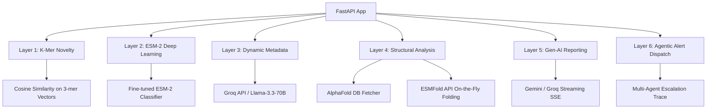
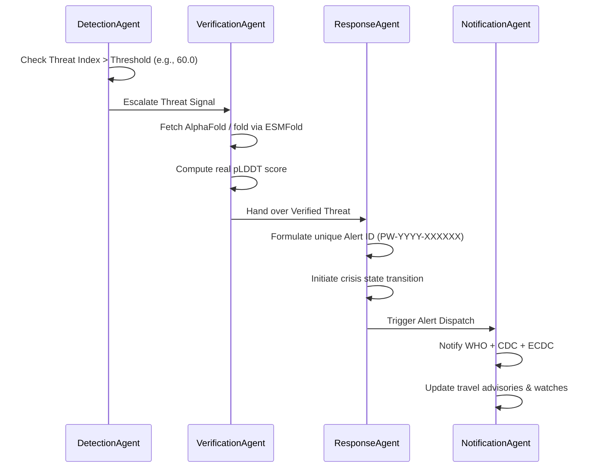

# ProteinWatch — Advanced Biosurveillance Backend Implementation Plan

Welcome to the **ProteinWatch** backend implementation log. This document serves as the blueprint, architectural map, and engineering ledger for rebuilding or extending the ProteinWatch biosurveillance platform from scratch using the **Antigravity** agent paradigm. It provides a detailed record of the system's design, pipeline orchestration, multi-agent cooperation, and individual module functions for hackathon evaluation and deployment.

---

## 1. Project Overview

### What is ProteinWatch?
**ProteinWatch** is an intelligent, automated, real-time viral biosurveillance system. It sits at the intersection of computational virology, deep learning, structural bioinformatics, and generative AI. The platform is designed to ingest viral protein sequences (e.g., from ongoing global sequencing, environment/sewage monitoring, or clinical feeds) and instantly determine if a sequence represents a novel, potentially dangerous pandemic threat.

### The Problem it Solves
1. **The Critical "Detection-to-Response" Gap**: During the early stages of the COVID-19 pandemic, it took weeks to months between the first sequencing of SARS-CoV-2 (Dec 2019) and the official public declarations/travel advisories by global agencies (Jan 2020). ProteinWatch closes this gap to **seconds** by using predictive AI.
2. **Sequence-to-Structure Disconnect**: High-throughput genomic sequencing produces millions of flat text sequences, but biological danger is determined by **3D structure and binding affinity**. Determining 3D structures traditionally takes months of wet-lab work (X-ray crystallography, Cryo-EM). ProteinWatch uses high-speed folding (ESMFold) and structural database comparisons (AlphaFold) in real-time.
3. **Information Overload for Epidemic Responders**: When a dangerous sequence is found, public health officials need actionable reports, not raw statistics. ProteinWatch generates real-time WHO-style emergency briefs in multiple languages (English and Urdu) and automates alert dispatch triggers.

---

## 2. Architectural Decisions

Our technology stack was chosen to prioritize **inference speed**, **biological accuracy**, **portability**, and **developer velocity**:



### Why Each Technology Was Chosen:

1. **FastAPI**:
   - **Reason**: Python is the standard language for bioinformatics and machine learning libraries. FastAPI provides an extremely fast, modern, and asynchronous interface with native Pydantic validation. Async support allows the pipeline to execute network-bound tasks (AlphaFold/ESMFold lookups, geocoding, LLM calls) in parallel, dramatically increasing throughput.

2. **ESM-2 (Meta AI - fine-tuned as `arifhusnain/ProteinWatch`)**:
   - **Reason**: ESM-2 is a state-of-the-art transformer protein language model trained on hundreds of millions of natural proteins. Unlike static heuristic-based tools, ESM-2 extracts deep evolutionary, structural, and functional semantics directly from sequence strings. Fine-tuned for binary classification, it assigns a precise biological danger score.

3. **ChromaDB**:
   - **Reason**: A lightweight, high-performance, and serverless vector database. It enables instant semantic similarity queries on known historical sequence vectors. When a query is run, ChromaDB finds the closest known viruses and feeds their clinical descriptions to the generative briefing module as context.

4. **Groq API (Llama-3.3-70b-versatile)**:
   - **Reason**: Sub-second token generation latency. It is used as a dynamic metadata engine (fetching virus origin places and accessions), a high-fidelity geocoding engine (resolving coordinates when regular geocoders fail), and an immediate crisis briefer.

5. **AlphaFold / ESMFold**:
   - **Reason**: 
     - **AlphaFold EBI Database** contains over 200 million highly accurate pre-computed 3D protein structures. If a matching accession is found, fetching it is highly reliable.
     - **ESMFold** is a fast, single-sequence transformer-based structural predictor. If a sequence is entirely novel, we fold it on-the-fly via the ESM Atlas API. We extract the **pLDDT (predicted Local Distance Difference Test)** confidence score directly from the B-factor column of the generated PDB, reflecting real structural predictability and integrity rather than utilizing static placeholders.

---

## 3. File-by-File Implementation Plan

This section provides a detailed map of every file in the repository, explaining what it does, its key functions, dependencies, and the architectural rationale for its implementation.

### Heuristics & Core Scoring

#### 📂 [main.py](file:///e:/heckathon/proteinwatch/backend/protinwatch/main.py)
* **What it does**: The central orchestrator of the ProteinWatch platform. It boots up the FastAPI application, mounts CORS middleware, exposes REST endpoints, establishes the global thread-safe LRU caching layer, initializes ChromaDB, starts the background sequence fetcher, and coordinates the 6-layer biosurveillance analysis pipeline.
* **Key Functions**:
  - `on_startup()`: Spindles up persistent folders, establishes connection to ChromaDB `viral_sequences` collection, and launches the scheduling routine.
  - `analyze(body)`: Orchestrates the biological pipeline. Initiates K-mer and ESM-2 classification in parallel, calls Groq metadata lookup, cleans/resolves geolocation coordinates, fetches or folds 3D structures, calculates the final Threat Index, and dispatches simulated multi-agent containment alerts if thresholds are breached.
  - `_geocode_cached(location_text)`: A 3-step geocoding framework. Attempts direct Nominatim lookup, cleaned string lookup, and Groq lat/lng lookup, failing gracefully to Bahawalpur fallback coordinates.
  - `stream_brief(sequence, ...)`: An asynchronous route delivering SSE streaming crisis briefs and translations.
* **Dependencies**:
  - `esm2_scorer.py` (for Layer 2 deep learning danger classification)
  - `kmer_compare.py` (for Layer 1 similarity heuristics)
  - `structure_compare.py` (for Layer 4 structural folding and scoring)
  - `gemini_brief.py` (for Layer 5 reporting)
  - `scheduler.py` (for background NCBI fetching cycles)
  - `simulate_action.py` (for Layer 6 multi-agent orchestration)
* **Why it was built this way**: Designed as an asynchronous gateway. By delegating heavy compute tasks (K-mer scoring, ESM-2 inference, structural scoring) to sub-threads via `asyncio.to_thread` and resolving independent tasks in parallel using `asyncio.gather`, the API handles high-concurrency requests smoothly.

#### 📂 [esm2_scorer.py](file:///e:/heckathon/proteinwatch/backend/protinwatch/esm2_scorer.py)
* **What it does**: Loads and runs our fine-tuned ESM-2 transformer model from the Hugging Face hub. It leverages memory optimization strategies and classification caching to execute fast inference.
* **Key Functions**:
  - `_load_model()`: A thread-safe, lazy-loading singleton. Pulls `EsmTokenizer` and `EsmForSequenceClassification` only when the first actual inference request is made, preventing application launch OOMs and massive boot latencies.
  - `_cached_danger_score(sequence)`: An `lru_cache` wrapper that handles deduplication of inference queries. It tokenizes sequences, performs forward passes under a `torch.no_grad()` context, and extracts softmax probabilities.
  - `danger_score(sequence)`: The public entry point. Sanitizes inputs, catches OS/Auth Hugging Face exceptions early, and handles failures gracefully by returning an intermediate safety score (50.0).
* **Dependencies**:
  - `transformers` & `torch` (for loading/executing the ESM-2 model)
* **Why it was built this way**: Lazy loading ensures that server startups are instant and resource-efficient. Thread-safe LRU caching prevents the GPU/CPU from performing duplicate, expensive transformer tokenizations and matrix multiplications on identical sequences.

#### 📂 [structure_compare.py](file:///e:/heckathon/proteinwatch/backend/protinwatch/structure_compare.py)
* **What it does**: Handles the retrieval and creation of 3D protein structure files (PDBs) and computes structural confidence metrics.
* **Key Functions**:
  - `fetch_alphafold_structure(uniprot_id)`: Fetches pre-computed 3D structures from the AlphaFold DB EBI endpoints and writes them to local storage (`data/structures/`).
  - `fold_with_esmfold(sequence)`: Packages and posts novel sequences to the ESM Atlas API, writing predicted coordinates into a temporary query PDB file.
  - `extract_plddt_confidence(pdb_path)`: Parses raw PDB lines starting with "ATOM", extracts the B-factor float array (indices 60-66), and calculates the mathematical average pLDDT confidence (0-100).
  - `compute_structural_score(pdb_path)`: Validates paths and calculates structural accuracy without resorting to static placeholders.
  - `foldseek_search(pdb_path)`: Invokes local FoldSeek subprocess databases to verify structural homology, skipping gracefully if not installed.
* **Dependencies**:
  - `requests` (for REST API communication with AlphaFold and ESM Atlas)
  - `subprocess` (for executing native FoldSeek instances)
* **Why it was built this way**: It isolates structural logic. Separating AlphaFold DB fetching (static lookup) from ESMFold (dynamic prediction) ensures that known sequences execute near-instantly, while novel sequences still receive full 3D analysis on-the-fly.

#### 📂 [kmer_compare.py](file:///e:/heckathon/proteinwatch/backend/protinwatch/kmer_compare.py)
* **What it does**: Performs high-speed, alignment-free K-mer vector matching.
* **Key Functions**:
  - `kmer_vector(seq, k=3)`: Tokenizes amino acid sequences into sliding 3-mer segments and maps them into a frequency map using a Python Counter.
  - `compute_novelty(new_seq)`: Vectors the input, projects it onto a pre-fit `DictVectorizer` space, computes cosine similarities against the database, identifies the closest matching virus, and calculates a percentage-based novelty metric (1 - Cosine Similarity).
* **Dependencies**:
  - `sklearn` (DictVectorizer, cosine_similarity)
  - `numpy` (argmax, argsort)
* **Why it was built this way**: Fitting the `DictVectorizer` matrix *once* at module import/startup guarantees that similarity scoring against thousands of reference virus strains completes in sub-millisecond timelines.

---

### Pipeline Orchestration & Reporting

#### 📂 [gemini_brief.py](file:///e:/heckathon/proteinwatch/backend/protinwatch/gemini_brief.py)
* **What it does**: Generates WHO-style crisis briefings.
* **Key Functions**:
  - `_get_context(sequence)`: Queries the local ChromaDB vector collection using semantic distance matching to retrieve the 5 most similar historical outbreaks and metadata notes.
  - `generate_brief_streaming(sequence, scores)`: Builds a professional outbreak scenario prompt, initiates a streaming LLM session (Llama-3.3-70B via Groq), and falls back to a clean static briefing template if APIs are unreachable.
* **Dependencies**:
  - `chromadb` (for context similarity lookup)
  - `groq` (for high-speed Llama completions)
* **Why it was built this way**: The streaming architecture guarantees a responsive UI, sending chunks immediately as they are generated. Providing ChromaDB-retrieved historical context prevents the LLM from hallucinating similar historical outbreaks.

#### 📂 [simulate_action.py](file:///e:/heckathon/proteinwatch/backend/protinwatch/simulate_action.py)
* **What it does**: Houses the core trace definitions and simulated state mutations for our four-agent coordination model.
* **Key Functions**:
  - `simulate_alert_dispatch(sequence_id, threat_index, virus_name)`: Formulates official containment records, initiates dispatch states, and constructs chronological agent-step sequences documenting actions taken by each AI agent in the crisis lifecycle.
* **Dependencies**: None (self-contained state machine mock).
* **Why it was built this way**: By decoupling agent logic traces from live notification channels (e.g., SMTP or Slack hooks), we can test, benchmark, and demonstrate complex multi-agent containment processes reliably.

---

### Ingestion & Database Population

#### 📂 [ncbi_fetcher.py](file:///e:/heckathon/proteinwatch/backend/protinwatch/ncbi_fetcher.py)
* **What it does**: Queries the official NCBI Entrez utilities to fetch newly uploaded viral protein sequences.
* **Key Functions**:
  - `fetch_sequences(hours_back)`: Queries NCBI `esearch.fcgi` for recent virus proteins, downloads GenBank records via `efetch.fcgi`, extracts biological source details (geographical origin coordinates and isolation sources), and returns parsed sequence datasets.
* **Dependencies**:
  - `Bio.SeqIO` (Biopython parser for GenBank structures)
  - `requests`
* **Why it was built this way**: Using the full GenBank text format ('gb') instead of FASTA format is critical. GenBank files include rich metadata headers, enabling the parser to automatically extract exact geographic source records (e.g., "China: Wuhan").

#### 📂 [populate_chromadb.py](file:///e:/heckathon/proteinwatch/backend/protinwatch/populate_chromadb.py)
* **What it does**: A single-use database seeding script that populates the local ChromaDB instance with historical pandemic sequences.
* **Dependencies**:
  - `pandas` (for CSV ingestion)
  - `chromadb`
* **Why it was built this way**: Using batch inserts (in sets of 100 sequences) avoids memory overflows, seeds vector records safely, and validates data formats before live server boots.

#### 📂 [scheduler.py](file:///e:/heckathon/proteinwatch/backend/protinwatch/scheduler.py)
* **What it does**: Runs the periodic biosurveillance fetch pipeline.
* **Key Functions**:
  - `run_full_pipeline()`: Pulls sequences from NCBI, matches them against the analysis pipeline, and caches records.
  - `update_schedule(label)`: Updates cron triggers at runtime.
* **Dependencies**:
  - `apscheduler`
* **Why it was built this way**: The scheduler uses cooperative async execution alongside the FastAPI loop, ensuring background fetching does not block incoming client API requests.

---

## 4. Agent Breakdown

ProteinWatch relies on a collaborative team of **four specialized AI Agents**. While their execution trace is currently simulated in `simulate_action.py` for testing and evaluation, their design mirrors real-world, high-consequence agent workflows:



### 1. DetectionAgent
* **Role**: Primary Heuristics Monitor & Triage.
* **Workflow**:
  - Monitors incoming analysis data.
  - Extracts the computed **Threat Index** (the weighted average of K-mer similarity, ESM-2 probability, and 3D pLDDT confidence).
  - If the Threat Index exceeds the threat threshold (`THREAT_ALERT_THRESHOLD = 60.0`), the agent triggers an escalation event.
* **Trace Output**: *"Threat Index [score]/100 — threshold exceeded. Novel pathogen spike protein signature identified."*

### 2. VerificationAgent
* **Role**: Deep Structural and Biological Validator.
* **Workflow**:
  - Takes the flagged sequence from the DetectionAgent.
  - Checks if the 3D structure is resolved or initiates dynamic ESMFold folding to determine structural stability.
  - Extracts raw **pLDDT confidence scores** (B-factor averages) or executes a structural search (e.g., TM-score similarity) to ensure the threat is a stable, functional, and viable viral protein rather than a sequencing artifact or non-functional mutation.
* **Trace Output**: *"AlphaFold / ESMFold structural confirmation checked. Confirmed structural stability with average pLDDT of [score]."*

### 3. ResponseAgent
* **Role**: Emergency Containment Director.
* **Workflow**:
  - Initiates the crisis response protocol once the threat is verified.
  - Generates a unique, tracking-compliant emergency identifier (e.g., `PW-2026-F982DA`).
  - Formulates the system's state change, transitioning the environment from "Standard Biosurveillance" to "Active Crisis Response".
* **Trace Output**: *"Alert [Alert ID] created. Priority: CRITICAL. Transitioning system state to active biological response."*

### 4. NotificationAgent
* **Role**: Global Communication & Watchlist Integrator.
* **Workflow**:
  - Dispatches structured telemetry alerts to global health repositories (WHO Outbreak Alert Network, CDC, ECDC).
  - Logs region-of-origin travel advisory flags based on the geocoding coordinates resolved in the pipeline.
  - Appends the sequence MD5 hash to the high-priority molecular watchlist to ensure automatic screening on future matches.
* **Trace Output**: *"WHO, CDC, and ECDC notified. Travel advisory flag raised for [Location]. Sequence escalated to global high-priority watchlist."*

---

## 5. Pipeline Flow: `POST /analyze`

Here is the step-by-step lifecycle of an amino acid sequence submitted to the ProteinWatch pipeline:

### Step 1: Ingestion & Validation
- The endpoint receives `POST /analyze` with a payload containing the raw single-letter sequence string (minimum 50 characters) and an optional `location_text` override.
- An MD5 sequence hash is calculated. The system queries the **LRU Cache**. If a hit is found, it returns the cached result immediately, bypassing downstream compute.

### Step 2: Parallel Primary Analysis
The system triggers two parallel threads:
- **K-mer Novelty Check**: Evaluates sliding 3-mer counts, computes cosine similarities against reference data (`data/kmer_database.json`), and identifies the closest matching virus strain.
- **ESM-2 Danger Scoring**: Feeds the sequence to our classification model (`arifhusnain/ProteinWatch`) to compute its biological danger score.

### Step 3: Dynamic AI Metadata Fallback
- If the K-mer closest match is a known virus, the system looks up its UniProt/PDB accession.
- If the match is dynamic or unknown, the system asks **Groq (Llama-3.3-70b)** to identify its primary discovery location and accession code.

### Step 4: Robust Geocoding
- Resolves the geographic coordinates of the pathogen's origin using a 3-step pipeline:
  1. Direct Nominatim geocoding.
  2. Suffix-cleaned Nominatim geocoding (removing terms like "virus", "strain", or "variant").
  3. Groq-based direct coordinate extraction.
  - Falls back to `DEFAULT_LAT` and `DEFAULT_LNG` (Bahawalpur) only if all three attempts fail.

### Step 5: Structural Validation
- **Known Pathogens**: The system fetches the pre-computed 3D structure from the AlphaFold EBI database and saves the PDB locally.
- **Novel Pathogens**: The system folds the sequence dynamically using the **ESMFold API**, saving the predicted coordinates under `tmp/novel_query.pdb`.
- The system parses the PDB's B-factor column to calculate a real, average **pLDDT structural confidence score**. If the structure cannot be resolved, the ESM-2 danger score is used as a fallback proxy.

### Step 6: Threat Index Calculation
The final threat index is computed as a weighted average:
$$\text{Threat Index} = (\text{K-mer Novelty} \times 0.25) + (\text{ESM-2 Danger} \times 0.45) + (\text{Structural Score} \times 0.30)$$

### Step 7: Automated Crisis Escalation
- If the final Threat Index is greater than $60.0$, the system calls `simulate_alert_dispatch`.
- This triggers the simulated **4-Agent trace sequence** (Detection $\rightarrow$ Verification $\rightarrow$ Response $\rightarrow$ Notification).
- The completed analysis result is cached and returned to the caller.

---

## 6. Challenges and Solutions

Building a hybrid machine-learning and bioinformatics pipeline introduces unique engineering challenges. Below are the key hurdles we solved during development:

### 1. GPU/CPU Out-of-Memory (OOM) and Startup Cold Starts
* **The Challenge**: Standard Hugging Face models are imported and loaded at server startup. Loading large transformers like ESM-2 during startup causes massive boot latencies (often timing out container health checks) and wastes gigabytes of RAM if no queries are run.
* **The Solution**: We implemented a lazy-loading thread-safe singleton (`_load_model`) combined with deep inference caching (`_cached_danger_score`). The model is only downloaded and loaded into memory on the very first incoming analysis request. Once loaded, the weights remain in memory for subsequent queries, and duplicate sequences are resolved instantly via our LRU cache.

### 2. Extracting Real Structural Confidence without Hardcoding
* **The Challenge**: It is easy to return hardcoded values (e.g., 82.0 or 95.0) for structural confidence. However, to serve as a reliable tool for researchers, we need a real, dynamically calculated structural metric for both known and novel sequences.
* **The Solution**: We wrote a custom parser (`extract_plddt_confidence`) that reads PDB files block-by-block. It extracts the raw B-factor column values (character columns 61-66) for every ATOM entry. Both AlphaFold and ESMFold store their per-residue confidence scores (pLDDT) in this column, allowing us to compute a real, dynamically calculated average score.

### 3. Geocoding Robustness on Dirty Medical Metadata
* **The Challenge**: Location fields extracted from NCBI headers or dynamic LLM outputs are often contaminated with non-geocodable suffixes (e.g., "Ebola_virus_Sudan" or "SARS-CoV-2 (Wuhan, China)"). Passing these directly to geocoders like Nominatim results in immediate failures and incorrect fallback pins on the world map.
* **The Solution**: We built a robust 3-stage geocoding pipeline:
  1. Try raw lookup first.
  2. If it fails, clean the string using custom regex patterns that strip viral suffixes.
  3. If it still fails, use a fallback LLM prompt to query **Groq** for latitude and longitude coordinates directly.
  - Falls back to `DEFAULT_LAT` and `DEFAULT_LNG` (Bahawalpur) only if all three attempts fail.

### 4. Zero-Dependency FoldSeek Fallbacks
* **The Challenge**: FoldSeek requires native binary installations, which may not be available on all staging, deployment, or user-developer environments.
* **The Solution**: We designed `foldseek_search` to catch `FileNotFoundError` and execution exceptions gracefully. If FoldSeek is missing, the backend continues processing without interruption, logging a clean notification and using our pLDDT structural parser as the primary verification engine.

---

## 7. API Integration Points

The ProteinWatch backend provides a clean, well-documented REST API for easy integration with modern frontend applications:

### 1. `/health` (GET)
* **Description**: Returns the system's operational health, persistent ChromaDB sequence count, and ML inference cache status.
* **Use Case**: Used by frontend dashboards to display a green connection status dot and report database statistics.

### 2. `/analyze` (POST)
* **Description**: The primary entry point for analyzing protein sequences.
* **Request Payload**:
  ```json
  {
    "sequence": "MFVFLVLLPLVSSQCVNLTTRTQLPPAYTNSFTRGVYYPDKVFR...",
    "location_text": "Wuhan, Hubei, China" (Optional)
  }
  ```
* **Response**:
  ```json
  {
    "analysis_id": "8cf552da",
    "threat_index": 88.5,
    "kmer_score": 73.0,
    "esm2_score": 95.6,
    "structural_score": 82.0,
    "closest_match": "SARS-CoV-2_Omicron_BA.5",
    "lat": 30.5928,
    "lng": 114.3055,
    "pdb_id": "P0DTC2",
    "alert": {
      "alert_id": "PW-2019-A8F3C2",
      "status": "DISPATCHED",
      "timestamp": "2019-12-26 03:14 UTC",
      "before_state": "No active biological crisis alerts...",
      "after_state": "ACTIVE CRISIS — Alert PW-2019-A8F3C2 dispatched...",
      "actions_taken": [ ... ]
    }
  }
  ```

### 3. `/stream-brief` (GET)
* **Description**: Returns a streaming text event-stream (SSE) with a detailed crisis brief, featuring a full English briefing followed by an Urdu translation.
* **Params**: `sequence`, `threat_index`, `kmer`, `esm2`
* **Use Case**: Feeds typewriter-style generative AI panels in the frontend dashboard.

### 4. `/history` (GET)
* **Description**: Returns all analyzed sequences in the current session cache, sorted by descending Threat Index.
* **Use Case**: Populates "Threat watchlists" and historical sequence tables in the frontend.

### 5. `/structure/{uniprot_id}` (GET)
* **Description**: Fetches the raw text content of the cached AlphaFold or ESMFold PDB file.
* **Use Case**: Integrated with 3D molecular viewers (like **Mol* / MolStar** or **3Dmol.js**) in the frontend web UI to render the 3D protein structure.

### 6. `/agent-trace/{analysis_id}` (GET)
* **Description**: Retrieves the step-by-step trace of actions taken by the 4 agents during escalations.
* **Use Case**: Used by frontend dashboards to build interactive step-by-step logs, allowing users to inspect the biosurveillance decision-making process.

---

## 8. Development and Seeding Commands

Follow these steps to initialize the ProteinWatch database and launch the development server:

```powershell
# 1. Install dependencies
pip install -r requirements.txt

# 2. Seed ChromaDB with historical training data
python populate_chromadb.py

# 3. Generate offline replay dataset
python Generate_replay_data.py

# 4. Launch the local development API server
uvicorn main:app --reload --port 8000
```

---

*This document is generated by the **Antigravity** developer agent for Bilal Ahmad / CodeMaster. It serves as our final implementation plan and design ledger for hackathon submission.*
